### TP  de Spring MVC, Spring Data JPA et le moteur de template Thymeleaf

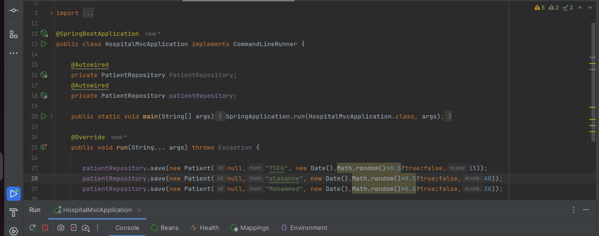

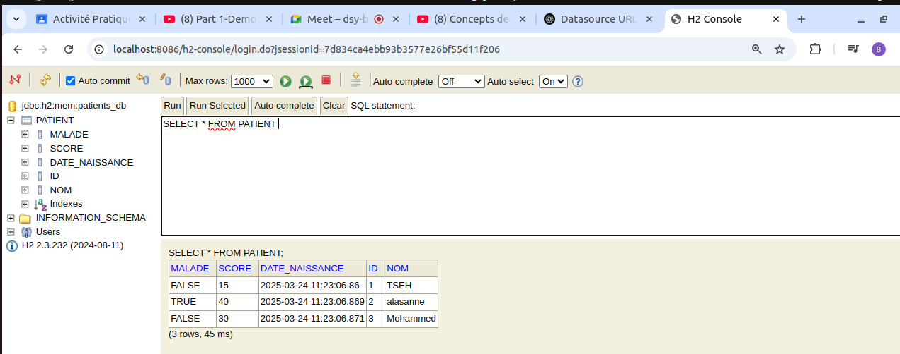

Dans cette partie nous avons utiliser spring mvc , en creant la classe controller 
 et en definissant la page ``patients.htlm`` pour  afficher la liste des  patients dans le navigateur

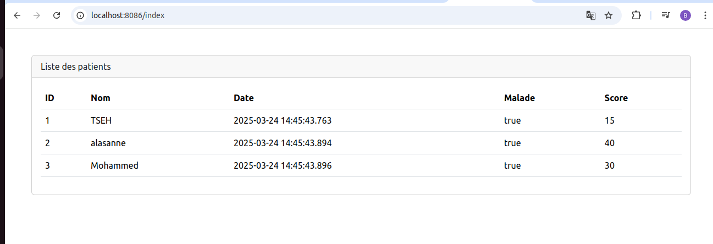

Nous affichons les element en offrant la possibilite de  naviguer dans les differentes pages 
via la pagination

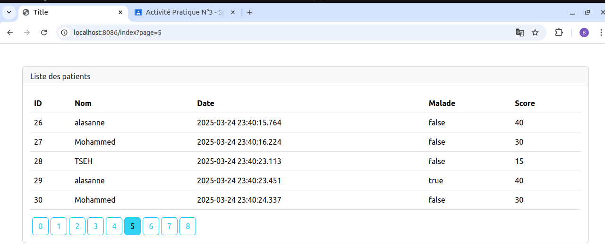

 Rechercher les element par les noms 
 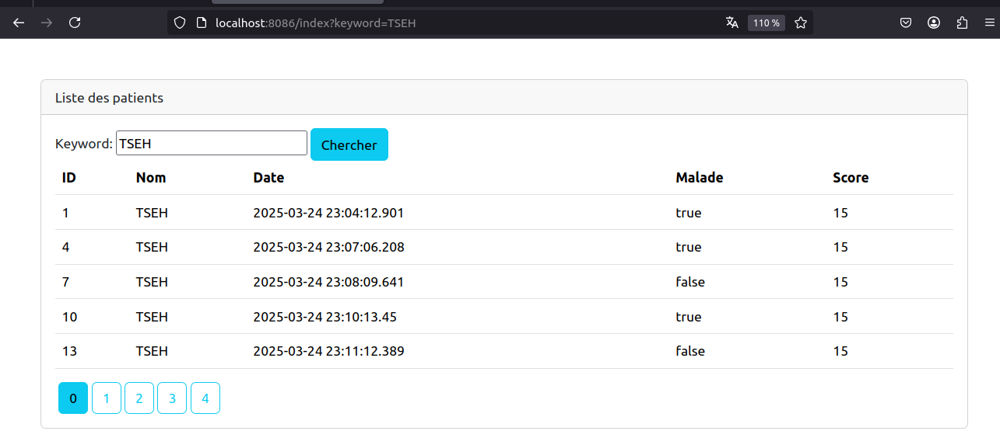
 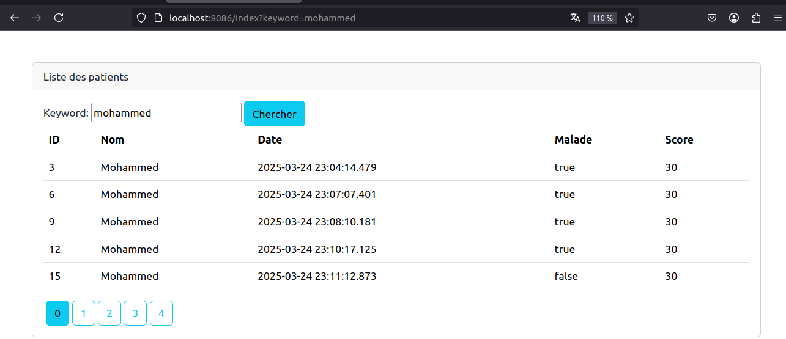
 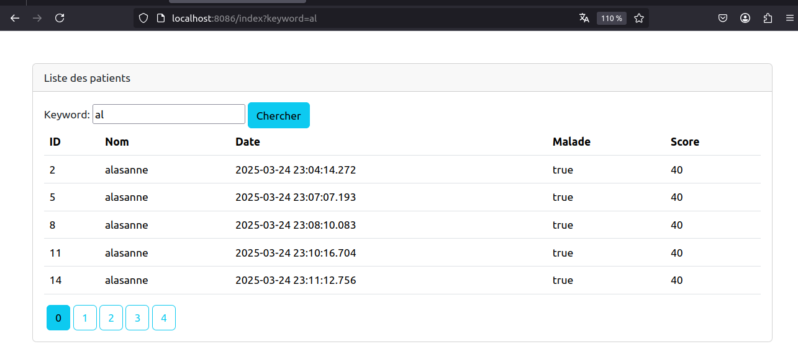

 Fonctionnalite de pour suprimer les elements de la liste
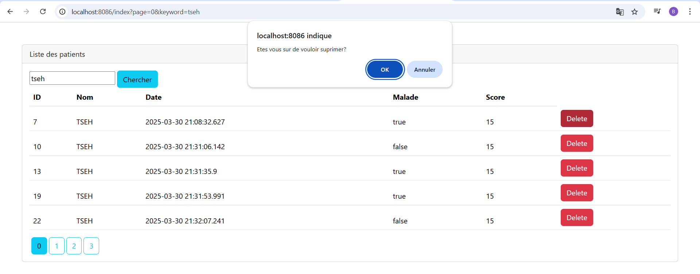

VERION AMELIOREEE:

Dans cette patie nous  allons ameliore l'application en  inserant la dépeendance de  bootstrap
icon ce qui a permis dutiliser les icône de recherche et de suppression
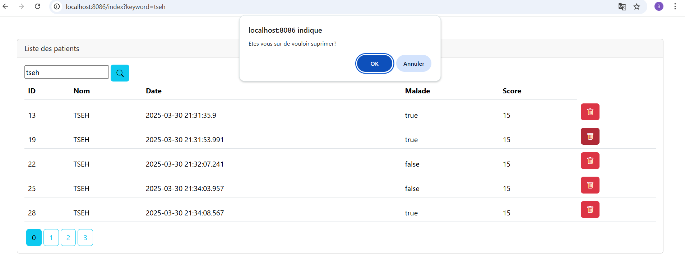

PARTIE 2 

Dans cette partie nous avons définir un template de la  avec   qui va etre utiliser pour 
décorer par les différentes pages de notre application
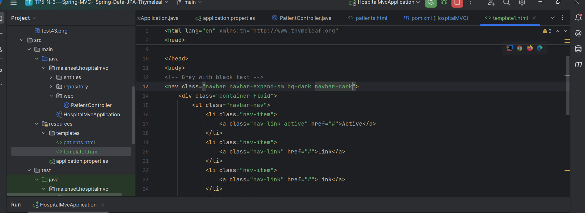
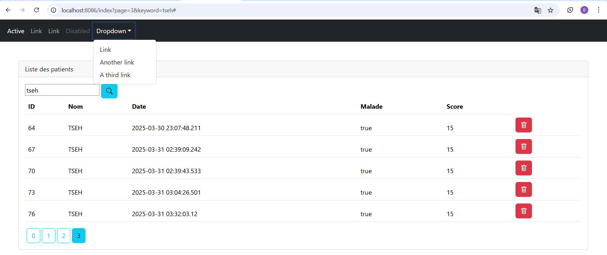

 