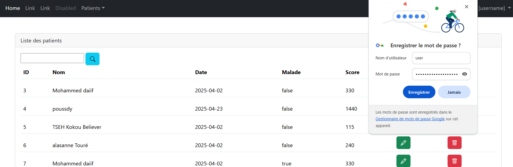
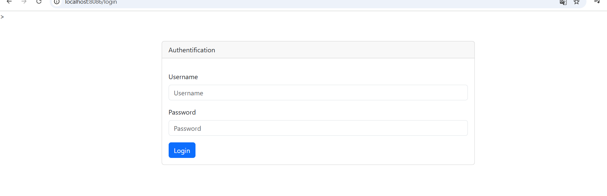

### TP  de Spring MVC, Spring Data JPA et le moteur de template Thymeleaf


Dans cette partie nous avons utiliser spring mvc , en creant la classe controller 
 et en definissant la page ``patients.htlm`` pour  afficher la liste des  patients dans le navigateur


Nous affichons les element en offrant la possibilite de  naviguer dans les differentes pages 
via la pagination


 Rechercher les element par les noms 
 
 
 

 Fonctionnalite de pour suprimer les elements de la liste


VERION AMELIOREEE:

Dans cette patie nous  allons ameliore l'application en  inserant la dépeendance de  bootstrap
icon ce qui a permis dutiliser les icône de recherche et de suppression


PARTIE 2 

Dans cette partie nous avons définir un template de la  avec   qui va etre utiliser pour 
décorer par les différentes pages de notre application


  
Après la  définissions de la page template, nous avons  avons définis un formulaire qui permet de 
 d'insérer une nouvelle patients  et procéder à a validation du formulaire pour définir a taille maximale et minimale , le score minimal du patient


PARTIE 3: SPRING SECURITY

 Nous commençons tout d'abord par  l'ajout de  la dépendance spring sécurity a notre projet.nous redémarrons notre 
application et nous essayons d'acceder au a l'application , nous pouvons voir la configuration par défaut suivant:


Le nom de passe génére par defaut permet d'acceder à l'application :




Nous allons personnalisé l configuration de la sécurité de l'application :
 pour  cela nous definissons trois utilisateurs  dont un est un admin :

 
 Noous pouvons nous connecter avec l'utilisateur :
- user: ```user1```
- password: ```1234```

 
Nous allons pousser un peu plus loin  en affichant le  nom de l 'utilisateur 
 qui est couranment   connecter ainsi que lui donner des droits.
Pour ce faire nous avaons besoin  d'inclure une dépendance qui est  qui est ```thymeleaf extra securrity```


 lorsque l'utilisateur  user1 tante de faire des modification alors qu' il n' ap as le droit , nous avons  le résultat suivant :

 par contre l' admin peut faire ces modification :


pour éviter que les utilisateurs n'ait pas  à voir le   
fontionnalitées auxquelles il n' pas dori , noua allons faire
la contextualisation. Et comme on peut le constater, les interface de ```user1``` et ```admin``` sont différentes


La personnalisation du formulaire de  validation 




 


 